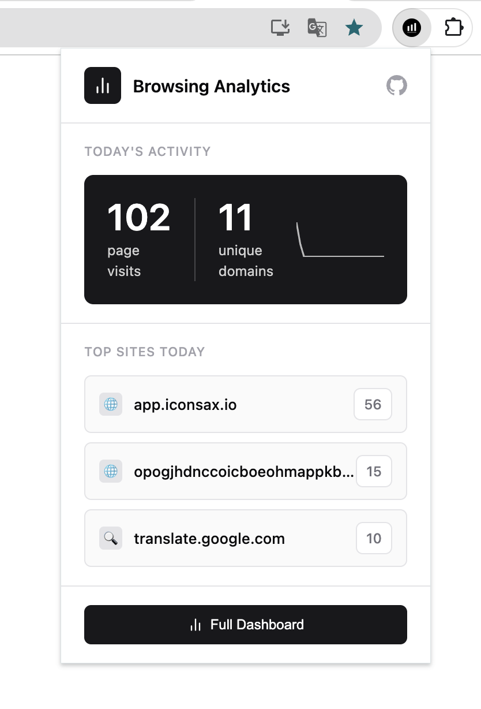
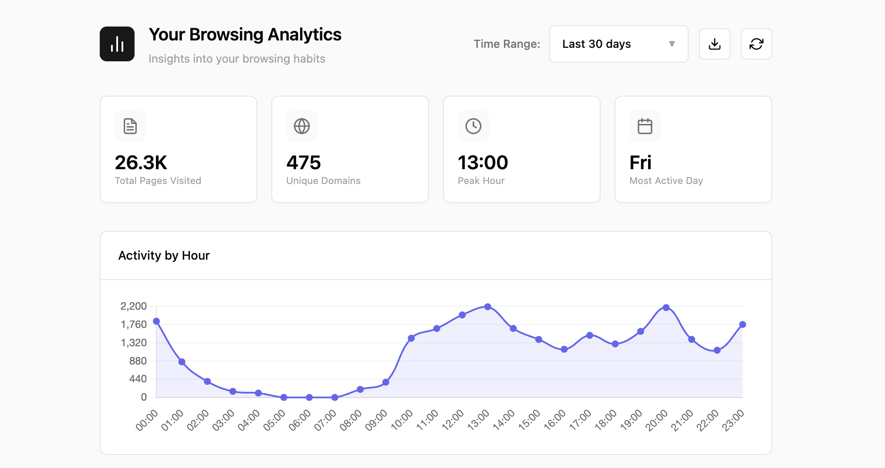
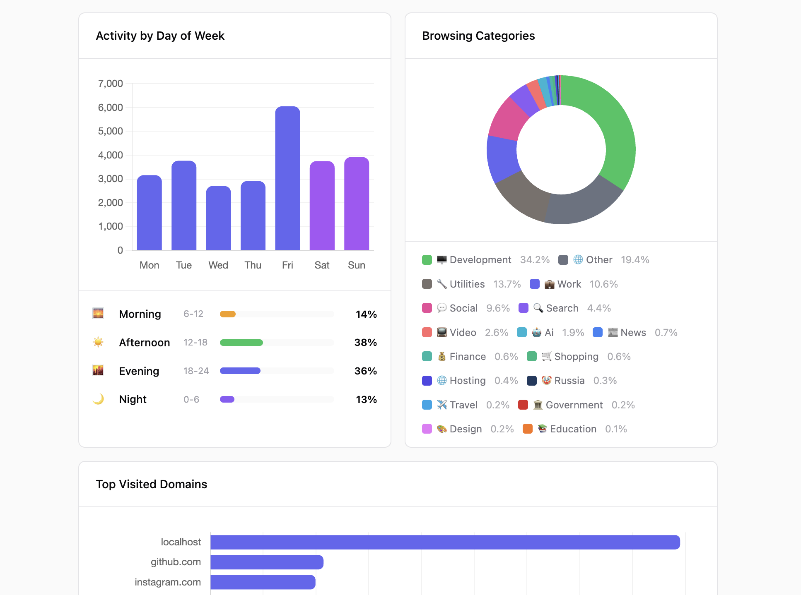

# Your Browsing Analytics

A privacy-focused Chrome extension that analyzes your browsing history locally and provides detailed insights into your web usage patterns.

## Screenshots

### Popup

### Dashboard Overview

### Activity Chart

## Features

- **100% Local Processing** - All data stays on your device. No servers, no tracking, no data collection.
- **Smart Categorization** - Automatically categorizes websites into 35+ categories
- **Visual Analytics** - Interactive charts for hourly/daily activity patterns
- **Date Range Filtering** - Analyze specific time periods
- **Export Data** - Export your analytics as JSON

## Categories

| Category | Links | Examples |
|----------|-------|----------|
| Development | 100+ | localhost, GitHub, IDEs, dev tools... |
| Work | 70+ | Slack, Notion, Jira, Google Workspace... |
| Video | 40+ | YouTube, Netflix, streaming services... |
| Gaming | 60+ | Steam, Twitch, game stores & news... |
| Music | 50+ | Spotify, SoundCloud, lyrics sites... |
| Social | 70+ | Facebook, Twitter, Reddit, Discord... |
| News | 80+ | CNN, BBC, tech news... |
| Finance | 60+ | Banks, crypto, trading platforms... |
| Shopping | 40+ | Amazon, eBay, e-commerce... |
| Education | 50+ | Wikipedia, Coursera, coding platforms... |
| AI | 40+ | ChatGPT, Claude, Midjourney... |
| Sports | 30+ | ESPN, live scores, sports leagues... |
| Jobs | 30+ | Indeed, LinkedIn Jobs, remote jobs... |
| Real Estate | 20+ | Zillow, property listings... |
| Travel | 40+ | Booking, Airbnb, maps, airlines... |
| Food | 30+ | Delivery apps, recipes... |
| Health | 30+ | Medical info, fitness apps... |
| Dating | 20+ | Tinder, Bumble, dating apps... |
| Weather | 10+ | Weather forecasts... |
| Automotive | 20+ | Car sales, auto news... |
| Podcast | 20+ | Podcast platforms... |
| Design | 40+ | Dribbble, Figma, design resources... |
| Hosting | 30+ | Domain registrars, web hosting... |
| Security | 30+ | VPNs, password managers, antivirus... |
| 3D Modeling | 20+ | Blender, Unity, 3D marketplaces... |
| Forums | 20+ | Discussion boards, communities... |
| Streaming Tools | 10+ | OBS, Streamlabs... |
| Legal | 20+ | Legal resources, court databases... |
| Government | 20+ | Government portals... |

## Privacy

- All processing happens locally in your browser
- No data is ever sent to external servers
- No tracking, no analytics collection
- Your browsing data never leaves your device
